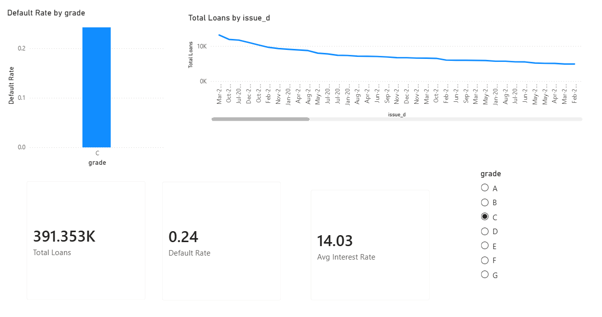
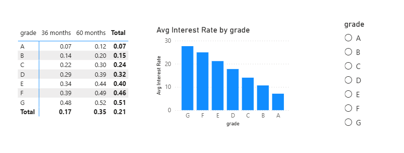
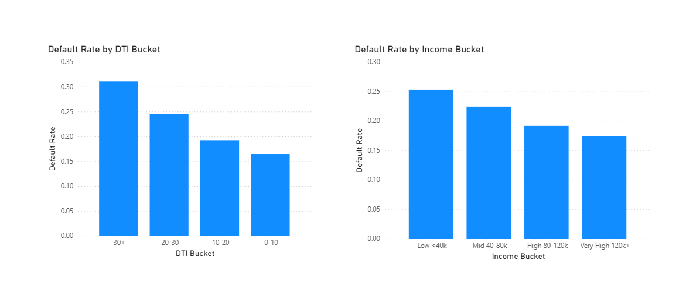
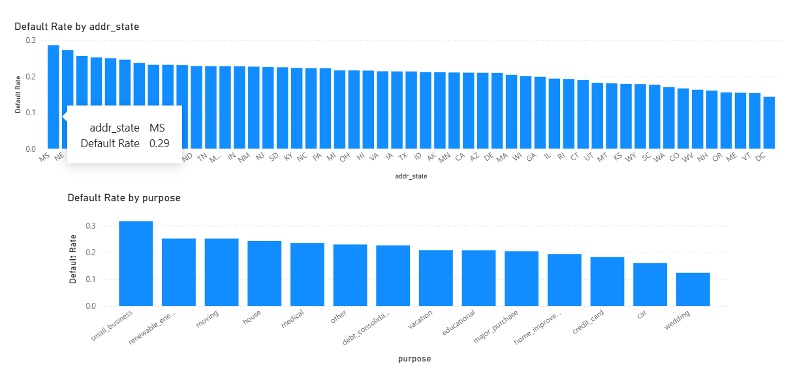

# Credit Risk Intelligence Dashboard

**Live app:** https://fintech-credit-risk-dashboard.streamlit.app/

Built on 1.37M real LendingClub loan records. The project is framed around one question: why did Capital One succeed while Wonga collapsed — when both were making the same lending decisions?


## The Story

- **Capital One** used data-driven credit scoring to price risk per borrower → became a top-10 US bank
- **Wonga** automated approvals without proper affordability checks → wrote off £220M in bad loans (2014) → collapsed in 2018

Same decision. Opposite outcomes. The difference was in the data.

This project replicates that exact risk-decision point using real loan data — the same signals (credit grade, DTI, income) that separate disciplined underwriting from the blind spot that sinks a company.

## What I Built

**Streamlit Web App** (live above)
- Portfolio KPIs, default rate by grade, loan trends over time
- Grade × Term risk matrix, interest rate pricing by grade
- Default rate by DTI bucket and income segment
- Geographic and purpose-level risk breakdown
- Interactive filters applied live across all views

**Power BI Dashboard** (4 pages, local)
- Same analysis rebuilt in Power BI with DAX measures and synced slicers
- Designed for a business/BI audience


**Power BI — Overview**


**Power BI — Risk Segmentation**


**Power BI — Affordability**


**Power BI — Geographic & Purpose**


## SQL Analysis

All core risk metrics were computed directly in MySQL before any visualization. See `analysis.sql` for the full query set — default rate by grade, DTI bucket, income segment, state, and high-risk segment isolation (Grade D-G + DTI > 30).

Sample:
```sql
-- High-risk segment: low grade + high DTI
SELECT purpose, COUNT(*), ROUND(AVG(is_default)*100, 2) AS default_rate
FROM loans
WHERE grade IN ('D','E','F','G') AND dti > 30
GROUP BY purpose ORDER BY default_rate DESC;
```

## Tech Stack

| Layer | Tool |
|---|---|
| Data source | LendingClub via Kaggle (2.26M raw records) |
| Cleaning | Python, pandas |
| Database | MySQL |
| Analysis | SQL (see analysis.sql) |
| BI Dashboard | Power BI — DAX measures, calculated columns, slicers |
| Web app | Python, Streamlit, Plotly |
| Deployment | Streamlit Community Cloud |

## Data Pipeline

1. Cleaned 2.26M records → 1.37M completed loans with known outcomes
2. Engineered `is_default` flag, DTI buckets, income buckets
3. Loaded into MySQL → ran SQL queries for all risk metrics
4. Built 4-page Power BI dashboard with DAX and slicers
5. Rebuilt as public Streamlit app for shareability

## Key Finding

Loans with DTI 30+ default at **31%** — nearly double the lowest DTI segment. That's the exact affordability signal Wonga's model missed. A proper risk model catches it. A shallow one doesn't.

## Run Locally

```bash
git clone https://github.com/Ritesh-453/fintech-credit-risk-dashboard.git
cd fintech-credit-risk-dashboard
pip install -r requirements.txt
streamlit run dashboard.py
```

## Author

Ritesh — IT Engineering student, working toward a Data Analyst role.