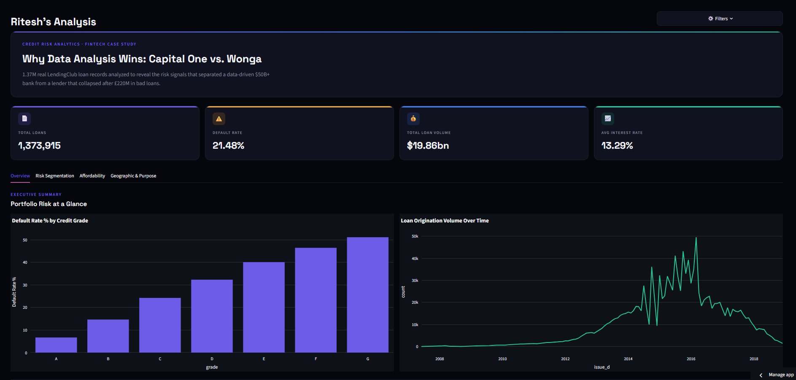
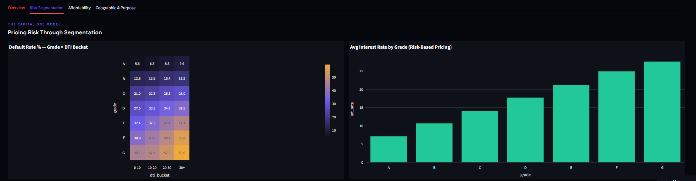

# Credit Risk Intelligence Dashboard

**Live app:** https://fintech-credit-risk-dashboard.streamlit.app/

A fintech credit risk analytics dashboard built on 1.37M real LendingClub loan records, framed around a real-world case comparison: **Capital One vs. Wonga** — two lenders that faced the exact same underwriting decision, with opposite outcomes.



## The Story

Every consumer lender faces the same core question: given a borrower's income, debts, and credit history, should the company lend to them — and at what rate?

- **Capital One** (founded 1994) used data-driven credit scoring to price risk per borrower, becoming a top-10 US bank.
- **Wonga**, a UK payday lender, automated approvals without rigorous affordability checks — wrote off £220M in loans (2014) and collapsed into administration in 2018.

This dashboard replicates that exact risk-decision point on real lending data, using the same signals — credit grade, debt-to-income ratio, income level — that separate disciplined underwriting from a blind spot that sinks a company.

## What It Does

- **Executive Overview** — portfolio-level KPIs, default rate by credit grade, loan origination trends over time
- **Risk Segmentation** — a Grade × DTI heatmap showing compounding risk, and interest rate pricing by grade (the Capital One model)
- **Affordability Analysis** — default rate by DTI and income bucket, isolating the exact signal weak affordability checks miss (loans with DTI ≥ 30 default at 2x the rate of low-DTI loans)
- **Geographic & Purpose Risk** — default rate breakdowns by state and loan purpose
- Interactive filters (grade, term, purpose) via a top-right filter panel, applied live across all views



## Tech Stack

| Layer | Tool |
|---|---|
| Data source | [LendingClub loan data](https://www.kaggle.com/datasets/wordsforthewise/lending-club) (Kaggle, 2.26M raw records) |
| Data cleaning | Python, pandas |
| Database | MySQL |
| Analysis | SQL |
| Business intelligence | Power BI (4-page dashboard, DAX measures, synced slicers) |
| Web dashboard | Python, Streamlit, Plotly |
| Deployment | Streamlit Community Cloud |

## Data Pipeline

1. Downloaded and cleaned 2.26M raw loan records → 1.37M completed loans with known outcomes
2. Engineered `is_default` target flag from loan status, plus DTI and income risk buckets
3. Loaded into MySQL for SQL-based risk analysis (default rate by grade, purpose, state, DTI, income)
4. Built a 4-page Power BI dashboard for BI-style exploration
5. Rebuilt as a public Streamlit web app for accessible, shareable analysis

## Key Finding

Loans in the highest DTI bracket (30+) default at **31%+**, nearly double the rate of the lowest-DTI segment — demonstrating exactly the kind of affordability signal a rigorous risk model catches and a shallow one misses.

## Run Locally

```bash
git clone https://github.com/Ritesh-453/fintech-credit-risk-dashboard.git
cd fintech-credit-risk-dashboard
pip install -r requirements.txt
streamlit run dashboard.py
```

## Author

Ritesh — IT Engineering student, building toward a Data Analyst role.